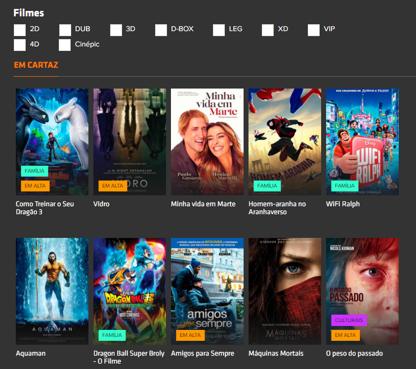

## Teste Ingresso.com Front-End Developer
A Ingresso.com enviou um teste para conhecer melhor o estilo de programar dos seus candidatos.

### Demanda
1. Criar um Layout para exibição de filmes em lista obtidos de nossa API de conteúdo, conforme exemplo abaixo.

2. Oferecer um filtro para troca de cidades, conforme parametro do Endpoint.
  * Ponto extra: adicionar botão para pesquisa de filmes no JSON resultante.
3. O click no banner do filme deve nos levar ao seu trailer do YouTube, caso o tenha e caso não o tenha, nos leve à página do filme.

### Pré-Requisitos
- Para conseguir visualizar esse site é necessário a instalação da extensão [Allow-Control-Allow-Origin](https://chrome.google.com/webstore/detail/allow-control-allow-origi/nlfbmbojpeacfghkpbjhddihlkkiljbi?hl=en) no chrome.

### Conclusão
No inicio do desenvolvimento me deparei com um problema de CORS ao tentar fazer chamada rest no endpoint forndecido da Ingresso.com.
Tive que instalar uma extensão no chrome chamada Allow-Control-Allow-Origin para conseguir fazer a chamada.

Para esse site resolvi fazer uma estrutura MVC utilizando knockout.js

[Link](https://pparadella.github.io/IngressoTeste/) para o site hospedado aqui no github.
